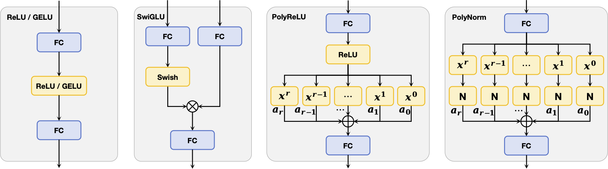
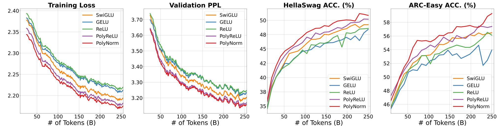
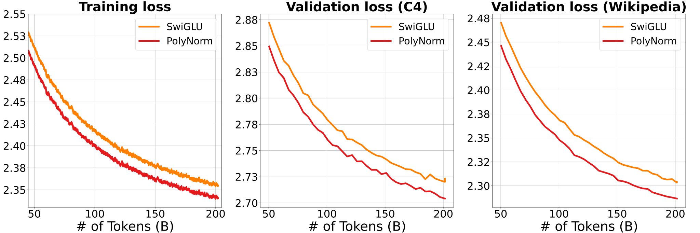
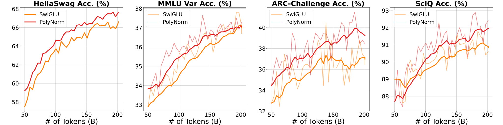

<div align="center">
 👋 Hi, everyone! 
    <br>
    We are <b>ByteDance Seed team.</b>
</div>

<p align="center">
  You can get to know us better through the following channels👇
  <br>
  <a href="https://team.doubao.com/">
    </a>
  <a href="https://github.com/user-attachments/assets/93481cda-a7f3-47f3-b333-fe6b3da86b78">
    </a>
 <a href="https://www.xiaohongshu.com/user/profile/668e7e15000000000303157d?xsec_token=ABl2-aqekpytY6A8TuxjrwnZskU-6BsMRE_ufQQaSAvjc%3D&xsec_source=pc_search">
    </a>
  <a href="https://www.zhihu.com/org/dou-bao-da-mo-xing-tuan-dui/">
    </a>
</p>


<!-- 注释：以上为Seed官方信息，可直接复制使用，请注意导入“Seed WeChat”（第12行）、“Seed logo”(第20行)图片替换 -->


# Polynomial Composition Activations: Unleashing the Dynamics of Large Language Models
<p align="center">
  <a href="https://github.com/BryceZhuo/PolyCom">
    </a>
  <a href="https://arxiv.org/pdf/2411.03884">
    </a>
  <!-- <a href="XXXX">
    </a> -->
  <a href="[XXX](https://opensource.org/license/MIT)">
    </a>
</p>

This repository contains the official implementation of  ICLR 2025 paper **[“Polynomial Composition Activations: Unleashing the Dynamics of Large Language Models](https://arxiv.org/pdf/2411.03884)”.**

In this work, we introduce a novel activation function called **Polynomial Composition (PolyCom)**, which enhances the expressiveness of large language models (LLMs) through dynamic polynomial compositions. Our method significantly improves the performance of dense and mixture of experts (MoE) models across a variety of downstream tasks, without adding significant computational overhead.


## Table of Contents

- [Polynomial Composition Activations: Unleashing the Dynamics of Large Language Models](#polynomial-composition-activations-unleashing-the-dynamics-of-large-language-models)
  - [Table of Contents](#table-of-contents)
  - [Introduction](#introduction)
    - [Visualized Training Dynamics](#visualized-training-dynamics)
  - [Pretraining](#pretraining)
    - [Dense model](#dense-model)
      - [Installation](#installation)
      - [Datasets](#datasets)
      - [Training](#training)
      - [Checkpoints](#checkpoints)
    - [MoE model](#moe-model)
      - [Installation](#installation-1)
      - [Datasets](#datasets-1)
      - [Training](#training-1)
  - [Using PolyNorm in Other Models](#using-polynorm-in-other-models)
  - [Citing this work](#citing-this-work)
  - [Acknowledgement](#acknowledgement)
  - [About ByteDance Seed Team](#about-bytedance-seed-team)

## Introduction

The core idea behind this work is the introduction of **Polynomial Composition Activations (PolyCom)**. By replacing traditional activation functions such as ReLU, GELU, and SwiGLU with polynomial composition functions, we enable models to capture more complex and dynamic patterns during training. This activation method improves both training stability and downstream performance, making it particularly beneficial for large-scale language models.

Key features:
- **Model Structure**: Supports dense models and mixture of experts (MoE) models.


### Visualized Training Dynamics
To illustrate the effectiveness of PolyCom, we provide visualizations of training loss, validation perplexity (PPL), and downstream performance on different models and datasets:

- **1B Dense Models**: Training and validation performance of dense models with PolyCom activations.


- **MoE Models with 1B activated parameters out of a total of 7B parameters**: Traning and validation loss on C4 and Wikipedia for MoE models with 200 billion training tokens.

Downstrean performance dynamics on HellaSwag, MMLU Var, ARC-Challenge, and SciQ for MoE models with 200 billion training tokens.


For more details, please refer to our paper: [Polynomial Composition Activations: Unleashing the Dynamics of Large Language Models](https://arxiv.org/pdf/2411.03884).

## Pretraining

### Dense model
#### Installation
```python
pip install -r requirements.txt -i https://mirrors.aliyun.com/pypi/simple/
```
#### Datasets
For the dense model, we use the RedPajama-Data-1T dataset. You can download it from [here](https://huggingface.co/datasets/togethercomputer/RedPajama-Data-1T). Then you need use [run_make_pretraining_dataset.sh](/dense_model/toolkits/pretrain_data_preprocessing/run_make_pretraining_dataset.sh) to change the dataset to the format mmap that our model can use.

#### Training
For the dense model, you can use the following command to train the model with PolyReLU activation:
```python
cd dense_model
bash run_pretrain.sh
```

#### Checkpoints
We provide the checkpoints of the dense model with PolyReLU and PolyNorm activations in the following links:

| Model       | Link                                                              |
| ----------- | ----------------------------------------------------------------- |
| PolyReLU_1B | [link](https://huggingface.co/Open-Foundation-Models/PolyReLU_1B) |
| PolyNorm_1B | [link](https://huggingface.co/Open-Foundation-Models/PolyNorm_1B) |

### MoE model
#### Installation
```python
cd moe_model
pip install -e .
```

#### Datasets
For the MoE model, we use the **OLMoE-mix-0924** dataset. You can download it from [here](https://huggingface.co/datasets/allenai/OLMoE-mix-0924). Then you need use the following command to change the dataset to the format that our model can use:
```python
dolma tokens \
--documents ${PATH_TO_DOWNLOADED_DATA} \
--destination ${PATH_WHERE_TO_SAVE_TOKENIZED_DATA} \
--tokenizer.name_or_path 'allenai/gpt-neox-olmo-dolma-v1_5' \
--max_size '2_147_483_648' \
--seed 0 \
--tokenizer.eos_token_id 50279 \
--tokenizer.pad_token_id 1 \
--processes ${NUMBER_OF_CPU_CORES_TO_USE}
```

 #### Training
To train the MoE model with PolyNorm activation, run:
```python
cd moe_model
bash run_pretrain.sh
```

## Using PolyNorm in Other Models
Using the follow PolyNorm class to replace other activation function like SwiGLU and ReLU.
```python
class PolyNorm(torch.nn.Module):
    def __init__(self, eps=1e-6):
        super(PolyNorm, self).__init__()
        self.weight = torch.nn.Parameter(torch.ones(3) / 3)
        self.bias = torch.nn.Parameter(torch.zeros(1))
        self.eps = eps

    def _norm(self, x):
        return x * torch.rsqrt(x.pow(2).mean(-1, keepdim=True) + self.eps)

    def forward(self, x):
        return self.weight[0] * self._norm(x**3) + self.weight[1] * self._norm(x**2) + self.weight[2] * self._norm(x) + self.bias
```

**Example: Adding PolyNorm to a Custom Model**
Below is an example of how to add PolyNorm to a simple feedforward network:
```python
class CustomModel(torch.nn.Module):
    def __init__(self, input_dim, hidden_dim, output_dim):
        super(CustomModel, self).__init__()
        self.layer1 = torch.nn.Linear(input_dim, hidden_dim)
        self.poly_norm = PolyNorm()  # Using PolyNorm as the activation function
        self.layer2 = torch.nn.Linear(hidden_dim, output_dim)

    def forward(self, x):
        x = self.layer1(x)
        x = self.poly_norm(x)  # Apply PolyNorm activation
        x = self.layer2(x)
        return x
```

## Citing this work
If you find this work helpful or use it in your research, please consider citing our paper:
```bibtex
@inproceedings{zhuo2025polycom,
  title={Polynomial Composition Activations: Unleashing the Dynamics of Large Language Models},
  author={Zhijian Zhuo and Ya Wang and Yutao Zeng and Xiaoqing Li and Xun Zhou and Jinwen Ma},
  booktitle={ICLR 2025},
  year={2025}
}
```

## Acknowledgement
Our work is based on the following repositories:
- [Pai-Megatron-Patch](https://github.com/alibaba/Pai-Megatron-Patch)
- [OLMoE](https://github.com/allenai/OLMoE)

Thank you for your interest in our work. We hope our contributions to large language model research provide valuable insights and tools for the research community.

## About [ByteDance Seed Team](https://team.doubao.com/)

Founded in 2023, ByteDance Seed Team is dedicated to crafting the industry's most advanced AI foundation models. The team aspires to become a world-class research team and make significant contributions to the advancement of science and society.
